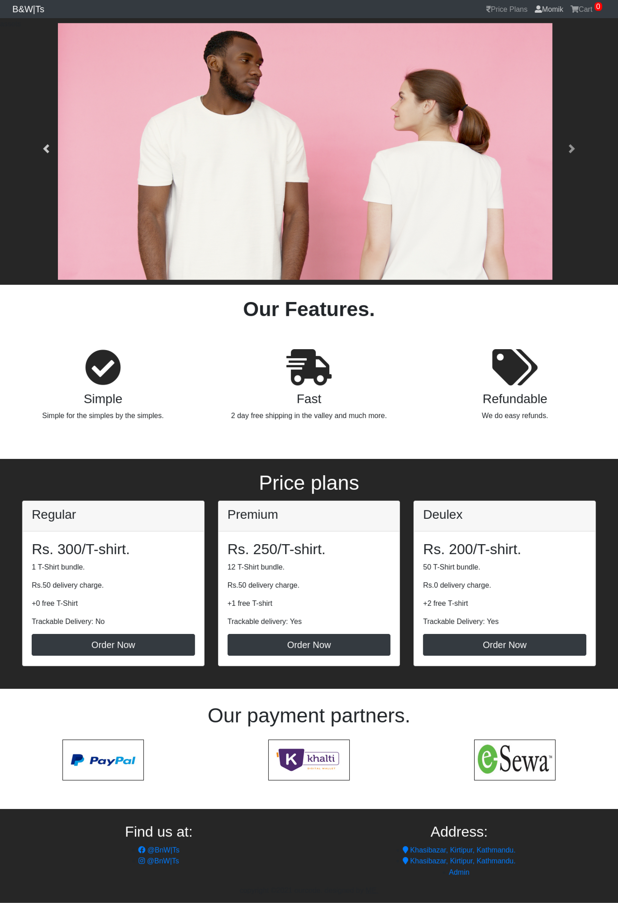
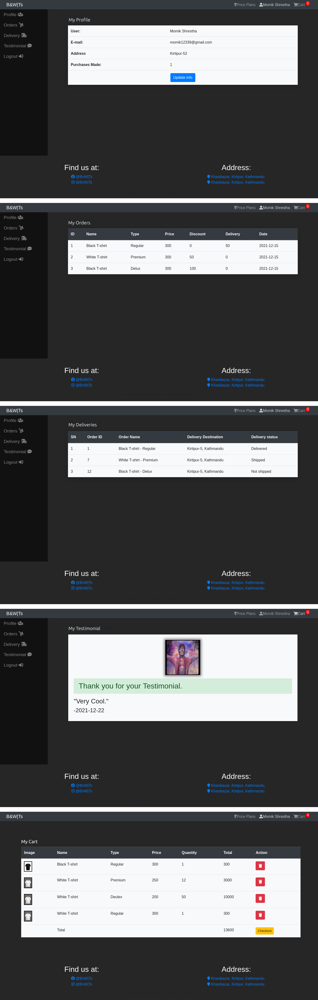
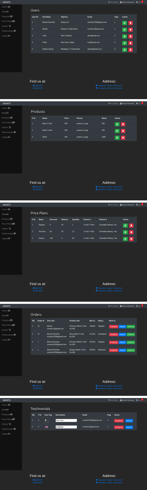

# eCommerce

5th Sem E-commerce project for MIS & E-Busines(CACS301).

# Introduction

Simple ecommerce project made in non OOP PHP.

# Features

- Admin Dashboard.
- User Dashboard.
- Registration and Login System.
- Cart.

# Incomplete Stuff

- Checkout System.
- Payment Gateway Integration.

# Database

- Uses MySQL database.
- ecommerce.sql is the mysql export file that consists of the database.

# Screenshots

## Home

## User Stuff

# Admin Stuff

# Thank You.
